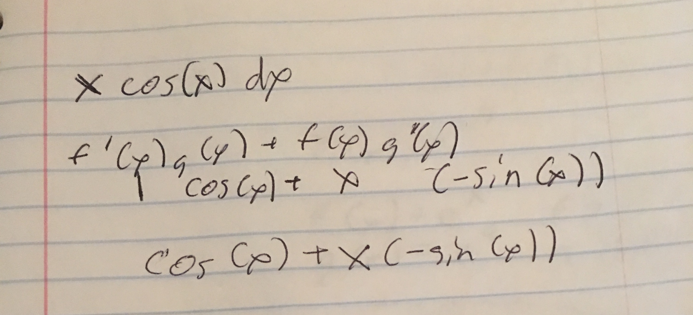

```{r setup, include=FALSE}
knitr::opts_chunk$set(echo = TRUE)
library("mosaic")
```

#1
Write a program to compute the derivative of $f(x) = x^3 + 2x^2$ at any value of x.
Your function should take in a value of x and return back an approximation to the
derivative of f(x) evaluated at that value. You should not use the analytical form
of the derivative to compute it. Instead, you should compute this approximation
using limits.

```{r}
f <- function(x) {
  (2*(x**2)) +x**3
}

derivative <- function(x, func) {
  h <- .0000000001
  (f(x+h) - f(x))/h
}


g <- D(f(x) ~ x)

c(derivative(1, f), g(1))
c(derivative(2,f),g(2)) 


```

#2
Now, write a program to compute the area under the curve for the function $3x^2+4x$
in the range x = [1; 3]. You should first split the range into many small intervals
using some really small $\Delta x$ value (say 1e-6) and then compute the approximation
to the area under the curve.

```{r}

j <- function (x) {
  3*(x**2)+4*x
}

reimann <- function(x_1, x_2, func) {
  delta<- 10**-6
  s <- seq(from=x_1, to=x_2, by = delta )
  
  area_under_curve <- 0
  
  for (x in 1:(length(s)-1))  {

    area_under_curve <- (func(s[x]) *delta)  + area_under_curve
  }

  return (area_under_curve)
}


reimann(1,3,j)

J <- antiD(j(t) ~ t)
J(3)-J(1)


```


#Images of analytical problems





