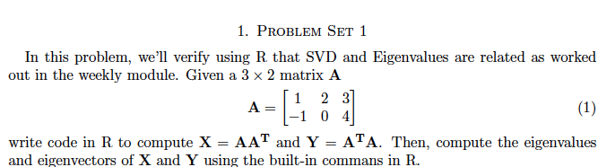
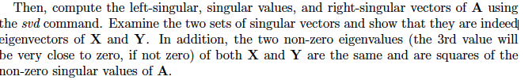
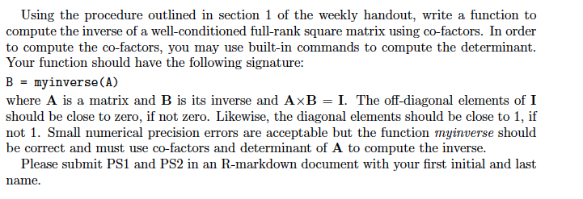

```{r setup, include=FALSE}
knitr::opts_chunk$set(echo = TRUE)
```

#Problem Set 1




$X=AA^T$
```{r}
A<- matrix(c(1,2,3,-1,0,4), ncol = 3  )

X <- A %*% t(A)
X

```

Calculate Eigen Vectors and Values of X
```{r}
eigen_values_X <- eigen(X)$values
eigen_values_X

eigen_vectors_X <- eigen(X)$vectors
eigen_vectors_X
```

$Y=A^TA
```{r}
Y <-t(A) %*% A
Y
```

Calculate Eigen Vectors and Values of Y
```{r}
eigen_values_Y <- eigen(Y)$values
eigen_values_Y

eigen_vectors_Y <- eigen(Y)$vectors
eigen_vectors_Y
```




<br><br>

$svd(A) = U \Sigma V^*$
```{r}
svd_A <- svd(A)
```

Left  Vectors (U) = Eigen Vectors of $AA^T$
```{r}
eigen_vectors_X[,1:2]
svd_A$u
```

Right  Vectors(V) = Eigen Vectors of $A^TA
```{r}
svd_A$v
eigen_vectors_Y[,1:2]
```


Singular Values = sqrt of the Eigen Values for either $A^TA$ or $AA^T$, with the extra values of $A^TA$ being zero or close to zero 
```{r}
svd_A$d
sqrt(eigen_values_X)
sqrt(eigen_values_Y)
```


#Problem Set 2




```{r}

myinverse <- function(A) {
  C <- diag (nrow(A))

  
  for (i in 1:nrow ( A )) {
    for (j in 1:ncol( A )) {
    C[i,j] <- ( det(A[(-1*i), (-1*j) ]) * ((-1)^(i+j) )  )

    }
  }
  T <- diag(nrow(A)) 

  for ( i in 1:nrow(A)) {
    row <- C[i,]
    for ( j in 1:length(row)) {
      T [ j,i ] <- row[j]
    }

  }
  inv <- 1/(det(A) ) * T
  inv
}

```


```{r}

A <- matrix(c(1, -1, 1, 1,1,1,1,2,4) , ncol = 3 , byrow =  TRUE )
A
B <- myinverse(A)
B
solve(A)

```